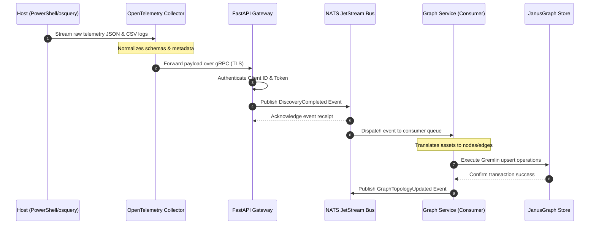
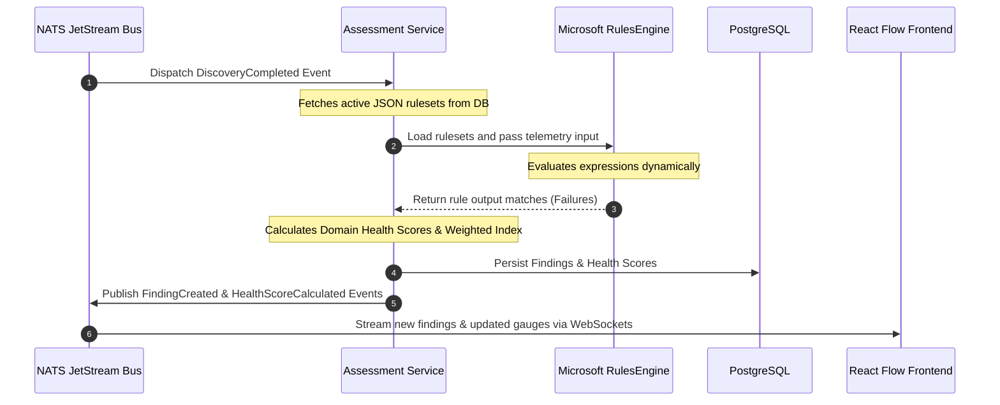
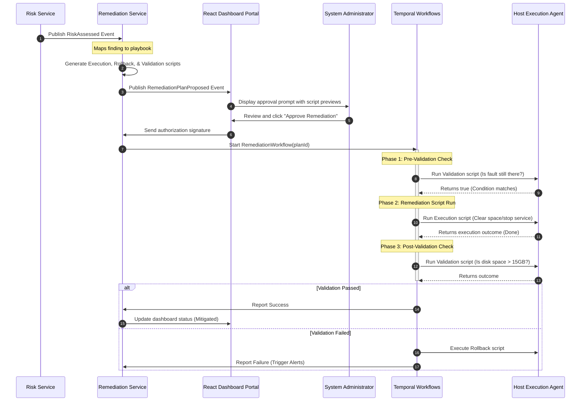

# Phase 2: System Workflows & Sequence Diagrams

This document contains visual workflow diagrams and detailed logic walkthroughs for the core system processing paths in Phase 2.

---

## 1. Telemetry Ingestion & Graph Update Workflow

This workflow tracks how raw system telemetry gathered by agents is normalized, ingested, and modeled inside the JanusGraph property graph.

### Sequence Diagram

### Walkthrough Steps
1.  **Telemetry Stream:** The PowerShell collector runs on the target machine, executing WMI queries and osquery calls, and streams normalized JSON results to the OpenTelemetry Collector.
2.  **Normalization:** The OpenTelemetry Collector acts as an edge aggregator, stripping out local formatting anomalies and applying global context tags (e.g., Tenant ID, Site ID).
3.  **Secure Ingestion:** The FastAPI gateway receives the structured OTel payload, verifies JWT credentials via OAuth2 Proxy, and formats a canonical asset payload.
4.  **Event Dispatch:** FastAPI publishes the `DiscoveryCompleted` event to the `eiip.discovery.completed` NATS topic.
5.  **Graph Synthesis:** The Graph Service consumes the event from NATS. It checks if the machine node already exists in JanusGraph. If not, it creates a `Machine` vertex. It then parses the JSON fields to generate child vertices (e.g., `OS`, `Port`, `Service`) and links them with relationships (e.g., `HOSTS`, `LISTENS_ON`, `RUNS`).

---

## 2. Rule Evaluation & Score Calculation Workflow

This workflow represents the reasoning engine evaluating evidence against rules to determine health scores and generate findings.

### Sequence Diagram

### Walkthrough Steps
1.  **Rule Trigger:** The Assessment Service receives the `DiscoveryCompleted` event containing normalized metrics and software catalogs.
2.  **RulesEngine Invocation:** The service fetches the active, JSON-defined policy rules from PostgreSQL and loads them into the Microsoft RulesEngine. It feeds the telemetry data into the engine as input objects.
3.  **Policy Evaluation:** The RulesEngine runs expressions (e.g., CPU utilization > 85%, admin accounts > 3). It compiles list of rule violations.
4.  **Score Deductions:** For every rule violated, the Assessment Service generates a `Finding` record and deducts points from the domain's 100-point base score based on severity (Critical: -25, High: -15, Medium: -8, Low: -3).
5.  **Persistence & Streaming:** The findings and scores are saved to PostgreSQL. The service publishes `FindingCreated` and `HealthScoreCalculated` events. A WebSocket server in FastAPI pushes these events to the React frontend, updating the radial gauges and table views.

---

## 3. Gated Remediation & Validation Workflow

This workflow outlines the process for proposing, validating, approving, and executing corrective actions.

### Sequence Diagram

### Walkthrough Steps
1.  **Remediation Proposal:** The Remediation Service consumes the `RiskAssessed` event. It matches the associated finding with an approved playbook (e.g., Disk Exhaustion finding maps to Temp Directory Cleanup script). It generates a plan containing the execution script, a validation script, and a rollback script.
2.  **Operator Gating:** The service publishes a `RemediationPlanProposed` event. The React dashboard displays an alert prompt to the administrator. The admin inspects the generated PowerShell commands.
3.  **Workflow Start:** Once approved, the dashboard sends the approval signature to the API. The Remediation Service starts the Temporal workflow `RemediationWorkflow`.
4.  **Temporal Orchestration:**
    *   **Pre-Check:** Temporal runs the Validation script on the target host. If the check returns true (fault exists), it proceeds.
    *   **Execution:** Temporal instructs the host agent to execute the corrective PowerShell commands.
    *   **Post-Check:** Temporal runs the Validation script again. If it returns true (fault resolved), it reports success.
5.  **Rollback Protection:** If the post-check fails, Temporal halts the workflow, triggers a compensating activity running the Rollback script, and flags the failure to the administrator.
