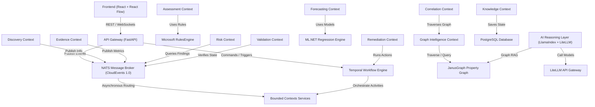

# Sentinel (EIIP) Service Dependency Graph

## Detailed Service Mappings

### 1. User Interface to API Gateway
- **Type**: Synchronous (HTTP/REST & WebSockets)
- **Dependency**: Frontend (`src`) depends on the FastAPI Backend to fetch assessment results, search packages, trigger scans, and stream terminal actions.

### 2. Message Bus Topology (NATS)
- **Type**: Asynchronous (Publish-Subscribe)
- **Schema**: CloudEvents 1.0 JSON format.
- **Data Flow**: Domain events like `ScanCompleted`, `FindingCreated`, and `RiskCalculated` are broadcasted through NATS to decouple microservices.

### 3. Workflow Orchestration (Temporal)
- **Type**: Distributed Orchestrator
- **Responsibility**: Coordinates multi-step, stateful processes such as remediation validation loops and scheduling daemon tasks.

### 4. Property Graph Database (JanusGraph)
- **Type**: Graph (TinkerPop Gremlin)
- **Storage**: Renders host-to-package dependency topology. Accessed exclusively by the Graph Intelligence Context and the AI reasoning layer.

### 5. Relational Database (PostgreSQL)
- **Type**: SQL
- **Responsibility**: Hosts metadata tables for Bounded Contexts (e.g., discovery configurations, task state tables, assessment scoring logs).
