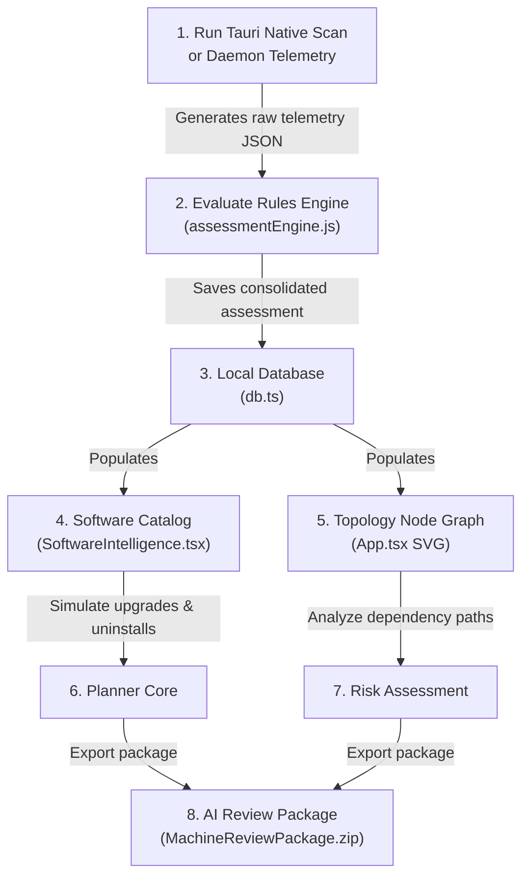

# Sentinel Platform - High-Level Code Walkthrough

Welcome to the **Sentinel Enterprise Infrastructure Intelligence Platform (EIIP)** code walkthrough. This document provides a high-level, business-friendly, and layman-friendly explanation of the files and directories that power Sentinel. 

Whether you are an IT administrator, a business stakeholder, or a developer, this guide will help you understand how Sentinel operates and how its components fit together.

---

## 🌟 Executive Summary: What is Sentinel?

Sentinel is like a **health checkup system for computers and servers**. In large organizations, IT teams struggle to keep track of:
1. What software is installed on every employee's computer.
2. Which programs are outdated, unsupported, or pose security risks.
3. How different services and programs rely on each other.

Sentinel solves this by running a quick, non-intrusive scan of a computer, storing that data safely inside the user's browser, and visualizing the system's health. It also lets users export this data into a secure package that can be analyzed by Artificial Intelligence (like Claude, ChatGPT, or Gemini) to provide smart architectural and security recommendations.

---

## 🏗️ Core Architecture & Data Flow

Sentinel is split into two primary layers:
1. **The Telemetry Collectors (Tauri Desktop App & Background Daemon Service):** Native Rust collectors that query local system instrumentation metrics, CPU loads, and firewall configurations programmatically on the host, returning a unified data structure.
2. **The Dashboard & Rules Engine (React Web App / assessmentEngine.js):** A visual web interface and JavaScript scoring engine that calculates health scores, evaluates rule matrices, renders interactive diagrams, and helps you plan updates.

Here is how data flows through the platform:

---

## 📂 File-by-File Breakdown

Here is a simple explanation of what each file in the codebase does:

### 1. Data Collection & Rule Evaluation
*   **[assessmentEngine.js](file:///c:/AIProjects/1_Sentinel/src/utils/assessmentEngine.js):**  
    *   *What it is:* The central rules and scoring engine.
    *   *What it does:* Analyzes raw telemetry data in JavaScript. It evaluates security controls, disk limits, and services to compute finding lists, health scores, risk matrices, and topology node graphs.
*   **[collector/daemon/src/collector.rs](file:///c:/AIProjects/1_Sentinel/collector/daemon/src/collector.rs) & [src-tauri/src/collector.rs](file:///c:/AIProjects/1_Sentinel/src-tauri/src/collector.rs):**  
    *   *What they are:* Rust-based native telemetry collectors.
    *   *What they do:* Spawn silent background queries to measure system performance and security baseline properties on the host, returning structured evidence payloads to the frontend.

---

### 2. User Interface & Dashboards (React Components)
*   **[App.tsx](file:///c:/AIProjects/1_Sentinel/src/App.tsx):**  
    *   *What it is:* The heart of the web application.
    *   *What it does:* This is the main controller file. It builds the sidebar layout, handles keyboard navigation shortcuts, logs system errors, and renders the central dashboards using Chakra UI v3 layout primitives. It also draws the **Interactive SVG Topology Node Graph** which lets users drag and drop system components (disks, services, hardware) to visualize dependency relationships and highlights.
*   **[index.css](file:///c:/AIProjects/1_Sentinel/src/index.css):**  
    *   *What it is:* The design system stylesheet.
    *   *What it does:* Defines the global visual theme tokens, custom cyberpunk scrollbars, scanline background filter grids, and green/pink pulse animations. Redundant vanilla CSS modal and toast classes are cleaned up in favor of Chakra UI v3 layout tokens.
*   **[main.tsx](file:///c:/AIProjects/1_Sentinel/src/main.tsx):**  
    *   *What it is:* The application entry point.
    *   *What it does:* Boots up the React application and wraps the component tree in the custom Chakra UI `Provider` to inherit our cyber-neon styles.
*   **[components/SoftwareIntelligence.tsx](file:///c:/AIProjects/1_Sentinel/src/components/SoftwareIntelligence.tsx):**  
    *   *What it is:* The Software Catalog.
    *   *What it does:* Renders the unified table of all installed software packages utilizing Chakra UI's table and input structures. It displays support lifecycle details (EOL, Deprecated), lists version mismatches, and features a simulation console drawer rendered inline to allow administrators to plan package upgrades or uninstalls.
*   **[components/SystemStatusPage.tsx](file:///c:/AIProjects/1_Sentinel/src/components/SystemStatusPage.tsx):**  
    *   *What it is:* The Sentinel self-health checker.
    *   *What it does:* Monitors Sentinel's internal state. It utilizes Chakra `<SimpleGrid>` and `<Progress>` meters to display information about the browser's storage capacity, show how many records are stored, display current IndexedDB tables, and track console warning/error history.
*   **[components/ReportIssueModal.tsx](file:///c:/AIProjects/1_Sentinel/src/components/ReportIssueModal.tsx):**  
    *   *What it is:* The support package generator.
    *   *What it does:* If a user encounters an error, this component lets them submit an issue. It utilizes Chakra dialog components, validation field wrappers, and automatically captures browser console logs, the active database schema, and environment profiles, bundling them into a ZIP archive for developers to debug.
*   **[components/ComingSoonPage.tsx](file:///c:/AIProjects/1_Sentinel/src/components/ComingSoonPage.tsx):**  
    *   *What it is:* Future roadmap previews.
    *   *What it does:* Displays clean placeholders, voter grids, and mock progress bars using Chakra card primitives for upcoming features.
*   **[components/ui/](file:///c:/AIProjects/1_Sentinel/src/components/ui):**
    *   *What it is:* Chakra UI v3 component composition directory.
    *   *What it does:* Houses snippets for core UI elements (e.g. `button.tsx`, `checkbox.tsx`, `dialog.tsx`, `field.tsx`, `provider.tsx`, `toaster.tsx`) generated by the Chakra CLI to serve as locally customizable design primitives.

---

### 3. Storage & Mock Data (Utilities)
*   **[utils/db.ts](file:///c:/AIProjects/1_Sentinel/src/utils/db.ts):**  
    *   *What it is:* The browser database controller.
    *   *What it does:* Utilizes Dexie.js (IndexedDB) to store all parsed assessment JSONs, historical scan points, and issue logs directly inside your web browser. This ensures **100% local-first privacy**—no data is uploaded to external servers.
*   **[utils/icons.tsx](file:///c:/AIProjects/1_Sentinel/src/utils/icons.tsx):**  
    *   *What it is:* Icon manager.
    *   *What it does:* Consolidates all visual icons (like package badges, checkmarks, trashcans, search lenses) used across tabs.
*   **[utils/mockData.ts](file:///c:/AIProjects/1_Sentinel/src/utils/mockData.ts) & [softwareMockData.ts](file:///c:/AIProjects/1_Sentinel/src/utils/softwareMockData.ts):**  
    *   *What they are:* Demo datasets.
    *   *What they do:* Provide realistic simulation profiles (e.g. vulnerable workstations, healthy systems, database servers, and standard software catalogs) so users can explore and test Sentinel's capabilities instantly without needing to run the PowerShell scanner first.

---

### 4. Tests & Quality Engineering
*   **[tests/unit/](file:///c:/AIProjects/1_Sentinel/tests/unit) & [tests/integration/](file:///c:/AIProjects/1_Sentinel/tests/integration):**  
    *   *What they are:* Automated testing suites.
    *   *What they do:* Written in PowerShell (Pester), these tests check the scoring and evaluation algorithms of the collector. They ensure that risks, software severities, and overall health scores are calculated with 100% accuracy.
*   **[tests/e2e/](file:///c:/AIProjects/1_Sentinel/tests/e2e):**  
    *   *What they are:* Browser simulation tests (Playwright).
    *   *What they do:* Simulate real user actions in the web browser (e.g., uploading files, clicking tabs, searching for packages, and dragging nodes in the dependency graph) to guarantee the visual dashboard runs flawlessly across all browsers.
*   **[tests/intelligence/evaluateRelease.js](file:///c:/AIProjects/1_Sentinel/tests/intelligence/evaluateRelease.js):**  
    *   *What it is:* The release gates evaluator.
    *   *What it does:* Runs comprehensive accuracy checks against "golden datasets" to confirm the platform is stable and ready to be compiled for production release.

---

## 🎯 Key Design Choices & Business Benefits

1.  **Zero-Server Privacy Architecture:**  
    By storing 100% of machine assessments inside the browser's local database (`IndexedDB` via `db.ts`), Sentinel guarantees that sensitive system specifications and software listings never leave the host machine. This is crucial for air-gapped enterprise environments.
2.  **High-Fidelity SVG Dependency Graphs:**  
    Rather than rendering static lists, Sentinel renders a real-time topology layout in `App.tsx`, showing the user how hardware resources, software applications, and network services interact.
3.  **Simulated Operational Planning:**  
    The planner inside `SoftwareIntelligence.tsx` lets IT admins see potential conflicts before they run package upgrades or uninstalls. This significantly reduces downtime caused by accidentally removing shared libraries or system components.
