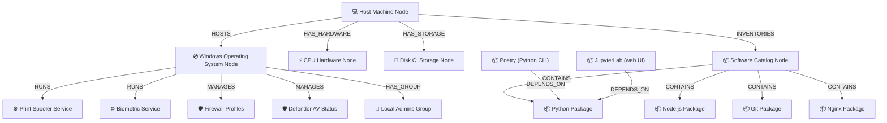

# Dependency Graph Guide

The **Topology View** in Sentinel renders an interactive, draggable network topology canvas powered by **React Flow (@xyflow/react)** and **Graphology**. This graph models service-to-host, database-to-host, and service-to-service relationships across your enterprise endpoints to visualize vulnerability blast radiuses and resource dependencies.

---

## 🕸️ Topology Architecture

Instead of presenting isolated inventories, Sentinel constructs relational property graphs. Below is a structural map of the node connections rendered in the topology graph:

---

## 🎨 Visual Indicator & Glow System

Nodes in the React Flow canvas are customized to display real-time health and vulnerability status indicators. They feature neon glowing borders dynamically resolved from active findings:

* **🟢 Neon Green Glow (Normal)**: The component is healthy and running within accepted baselines (e.g. BitLocker encryption is fully enabled, Defender AV is active, disk free space is > 15%).
* **🟡 Neon Orange Glow (Warning)**: The component has non-critical issues (e.g. Local Administrator privileges sprawl, a medium-severity CVE exists, or minor version upgrades are available).
* **🔴 Neon Red Glow (Error/Critical)**: The component requires immediate attention (e.g. Disk C: storage is critically low, a critical CVE is active on an exposed service, or a required automatic service is stopped).

---

## 🖱️ Canvas Controls & Inspector

* **Pan & Zoom**: Scroll or pinch to zoom, click and drag the canvas background to pan across large topology maps.
* **Draggable Layout**: Click and hold any node to reposition it dynamically. The canvas automatically updates edge paths.
* **Link Direction Indicators**: Flowing animated dashed lines show connection routes, making it easy to identify dependent chains (e.g., packages referencing runtime packages).
* **Node Selection & Side Inspector**: Clicking a node selects it and opens the **Side Inspector Panel**. The panel queries details from the JanusGraph property nodes, rendering system information, CIM specifications, active open ports, or software version metadata.

---

## ❓ Operational Impact Analysis

Visualizing relationships helps administrators assess the blast radius of changes:

### Example: Upgrading Web Servers
If the topology maps a critical database node connected to a web server service, taking the web server offline for maintenance will block database traffic. The graph renders these dependencies so operators can schedule safe maintenance windows.

### Example: Package Deprecation
If a developer proposes uninstalling Python to save disk space, a glance at the catalog node graph displays that Poetry and JupyterLab are connected via `DEPENDS_ON` relationships. Uninstalling Python will break both dev tools.

By modeling these relationships, Sentinel provides complete **operational impact awareness** before any shell script or upgrade commands are executed.
