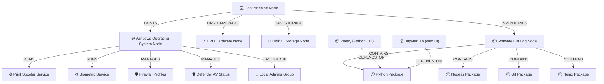

# Dependency Graph Guide

The **Topology View** in EIIP renders an interactive, draggable SVG node graph. This graph maps out your entire environment to show how your host machine, operating system configuration, services, security profiles, and software packages are interconnected.

---

## 🕸️ Topology Architecture

Instead of presenting isolated inventories, EIIP builds relationships. Below is a structural map of the node connections rendered in the topology graph:

---

## 🎨 Visual Indicator System

Nodes are color-coded to immediately highlight areas of vulnerability:

* **🟢 Green Outline (Normal)**: The component is healthy and running within accepted baselines (e.g. Defender AV is active, disk free space is > 15%).
* **🟡 Orange Outline (Warn)**: The component has non-critical issues (e.g. Local Administrator privileges sprawl, a medium severity CVE exists, or minor version upgrades are available).
* **🔴 Red Outline (Error)**: The component requires immediate attention (e.g. Disk space is critically low, a critical CVE is active on an exposed service, or a required automatic service is stopped).

---

## 🖱️ Drag-and-Drop Interactive Controls

* **Selecting Nodes**: Clicking any node in the SVG window highlights the node and opens a **Detailed Inspector Card** in the right drawer, showing hardware specs, paths, versions, and security states.
* **Moving Nodes**: Click and hold any node, then drag it to clean up the visual layout. The nodes will automatically snap and stick to their new coordinates, respecting the graph borders.
* **Link Direction Indicators**: Arrowheads indicate the dependency direction, allowing you to trace the impact of a planned component removal.

---

## ❓ Why Dependency Analysis Matters

Understanding dependencies prevents catastrophic downtime.

### Example: Upgrading Nginx
Suppose the dashboard highlights **Nginx** in 🔴 **Red** due to a critical security vulnerability (`CVE-2023-44487`). Before upgrading or removing it, looking at the graph shows that Nginx is managed by the OS. Removing it carelessly could drop hosting listeners.

### Example: Removing Python
Suppose a user wants to free up space and uninstalls Python. The graph shows that `Poetry` and `JupyterLab` point to Python with `DEPENDS_ON` links. Removing Python breaks both toolchains. 

By visualizing these relationships, EIIP ensures engineers have **operational impact awareness** before executing changes on the terminal.
