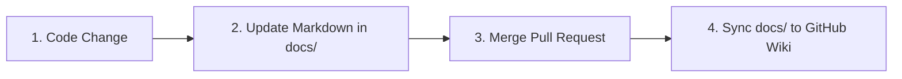

# Documentation Governance Guide

This document establishes the processes, standards, and responsibilities for updating and maintaining the Enterprise Infrastructure Intelligence Platform (EIIP) documentation.

---

## 🛠️ How Documentation is Updated

To ensure that the documentation evolves alongside the platform code, we follow a structured contribution workflow:



1. **Local Modifications**: All wiki documentation is stored as markdown files in the [docs/](file:///c:/AIProjects/1_Sentinel/docs) folder of the main repository. Do not edit the GitHub Wiki directly through the web UI.
2. **Pull Request Validation**: Any pull request that introduces UI changes, CLI updates, or new findings must include corresponding updates to the markdown files in `docs/`.
3. **Automated Wiki Sync**: Upon merging a branch to `main`, a CI/CD workflow cloning the wiki git repository automatically pushes updates from the `docs/` folder, ensuring the published wiki is always synchronized.

---

## 🏷️ Versioning Strategy

Documentation is versioned in lockstep with the core platform release versions, using semantic versioning (`MAJOR.MINOR.PATCH`):

* **Major Releases (e.g., 2.0.0)**: Accompanied by full updates to the **Getting Started**, **Dashboard**, and **AI Review Package** guides. These releases correspond to new strategic pillars (such as transitioning from Reason to Act).
* **Minor Releases (e.g., 1.2.0)**: Update the **Software Intelligence** and **Assessment Guides** to reflect new package manager collectors, CVE filters, or risk algorithms.
* **Patch Releases (e.g., 1.0.1)**: Reserved for typo fixes, clarification updates, or formatting adjustments in the markdown files.

---

## 📋 Release Note Process

Every release build requires a populated **Release Quality Report** using the [ReleaseNotesTemplate.md](ReleaseNotesTemplate.md) format.
1. Run the **Automated Quality Engineering Evaluator** script to output metrics (Discovery Accuracy, Assessment Accuracy, Graph Accuracy).
2. Populate the **Dataset Evaluation Matrix** by running automated validation sweeps against the 8 core profile datasets (vulnerable-workstation, ai-workstation, database-server, etc.).
3. Record new features, bug fixes, and deprecations in the changelog section.
4. Save the finalized release notes in a folder under `docs/releases/v[X.Y.Z].md`.

---

## 📸 Screenshot Refresh Process

To maintain visual accuracy, screenshots should be refreshed whenever significant UI changes are merged.

### Refresh Protocols:
* **Storage Location**: Save all screenshot assets under `docs/images/`.
* **Standard Resolution**: Capture screens at a standard width of `1280px` or `1920px` to maintain high fidelity on modern displays.
* **Visual Theme**: Use the default dark high-contrast theme (with CSS variables like `--color-cyan` and HSL custom colors) to ensure color consistency across images.
* **Labeling Rules**: Ensure that screenshots are embedded using the standard markdown syntax:
  ```markdown
  
  ```
  *(Note: Do not wrap paths in backticks, as this breaks link formatting).*
