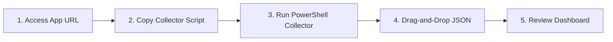

# Getting Started with EIIP

This guide will walk you through accessing the Enterprise Infrastructure Intelligence Platform (EIIP), running the collector script, importing your first assessment, and review results based on your role.

---

## 🧭 Step-by-Step Setup



### 1. Accessing the Application
Open the EIIP web application URL in your preferred modern web browser. The app runs as a single-page static application. No user registration, accounts, or database installations are needed.

### 2. Locating the Collector Script
Navigate to the **Assessment Importer** tab in the main navigation. Download or copy the PowerShell collector script:
* File location in repository: [Invoke-EIIPAssessment.ps1](file:///c:/AIProjects/1_Sentinel/collector/Invoke-EIIPAssessment.ps1)

### 3. Running the Collector Script
On the Windows machine you want to assess, run PowerShell with appropriate permissions:

> [!TIP]
> While you can run the collector as a standard user, running as **Administrator** allows the script to fetch full hardware data (e.g. BitLocker status, motherboard details) and scan all user profiles.

1. Open the Start menu, search for **PowerShell**, right-click it, and select **Run as Administrator**.
2. Run the following command to temporarily bypass execution policies (only for this process shell) and execute the script:
   ```powershell
   Set-ExecutionPolicy Bypass -Scope Process -Force
   & "C:\Path\To\Invoke-EIIPAssessment.ps1"
   ```
3. The script will perform reads of your system registry, active services, storage disks, and package managers (Winget, Chocolatey, Scoop, WSL, Docker, pip, npm).
4. Once completed, it will save a unified report on your Desktop named:
   `Assessment.json`

### 4. Importing the Assessment
1. In the EIIP browser window, select the **Assessment Importer** tab.
2. Drag-and-drop the generated `Assessment.json` file from your desktop into the upload panel, or click the upload panel to browse and select the file.
3. The interface will immediately parse the data, update the active dashboard view, and save the run to your browser's IndexedDB history log.

### 5. Reviewing the Results
Once the import is complete, check your dashboard scores and explore the findings.

``
*Placeholder: Screenshot of the Assessment Importer tab showing drag-and-drop area and upload status logs.*

---

## 👤 User Personas Workflows

To help you get the most out of EIIP, we have defined tailored workflows for four core target personas:

### 🏠 1. Home User
* **Goal**: Keep personal computers running reliably and plan software upgrades cleanly.
* **Workflow**:
  1. Import the latest assessment.
  2. Navigate to the **Software Intelligence** tab.
  3. Filter the update state by **Update Available** or **End-of-Life**.
  4. Expand the details drawer of outdated packages to view their upgrade paths.
  5. Use the **Actions** tab in the drawer to review automated command lines to run locally.

### 💻 2. Developer
* **Goal**: Validate that your machine has the right environments to support local LLMs, Docker containers, database engines, and software toolchains.
* **Workflow**:
  1. Run the assessment script after installing new development tools.
  2. Open the **AI Chat Guardian** tab and select the **AI Review Package** panel.
  3. Click **Export AI Review Package** to download the `MachineReviewPackage.zip`.
  4. Upload the ZIP to your organization's AI assistant (e.g. Claude or ChatGPT) and run the **AI Development Workstation Review** prompt.

### ⚙️ 3. Infrastructure Engineer
* **Goal**: Conduct risk analysis, motherboard/CPU validation, and capacity planning.
* **Workflow**:
  1. Open the **Dashboard** and check the **Overall Health Score** and sub-component health gauges (Performance, Reliability, Scalability).
  2. Navigate to the **Capacity Forecasting** tab.
  3. Review the linear regression charts to see when storage capacity on Disk C: is predicted to cross the 90% and 95% critical exhaustion thresholds.
  4. Compare historical scores in the history timeline to see if system capacity demands are increasing.

### 🕵️ 4. Security Analyst
* **Goal**: Inspect vulnerability exposure, administrative privileges, and software lifecycles.
* **Workflow**:
  1. In the dashboard, inspect the **Risk Matrix** quadrant to see if there are any critical severity/high likelihood risks.
  2. Click the **Auditor** tab to filter findings by the **Security** domain and **Critical** / **High** severity.
  3. Go to the **Topology** graph view, locate the `local_admins` node, and click it. Review the active list of administrator accounts in the details card to check for privilege sprawl.
  4. Search the software catalog for deprecated or unsupported components.
