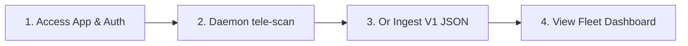

# Getting Started with Sentinel (EIIP)

This guide will walk you through accessing the Enterprise Infrastructure Intelligence Platform (EIIP) / Sentinel, logging in with your RBAC credentials, running the telemetry collector daemon, streaming data to the ingestion API, and reviewing the results across the fleet.

---

## 🧭 Step-by-Step Setup

### 1. Accessing and Authenticating
1. Open the Sentinel web application in your browser, or launch the Tauri native desktop app.
2. You will be greeted by the **InsForge Auth Single Sign-On (SSO)** gateway.
3. Log in with your corporate account credentials. 
4. The system will load your permissions based on your assigned RBAC role:
   * **Admin**: Full access (run scans, execute remediations, approve actions, modify settings).
   * **Operator**: Read-write access (run scans, trigger remediation workflows).
   * **Auditor**: Read-only access (view dashboard, topology graphs, and export reports).

### 2. Running a Live Scan (Daemon Telemetry Streaming)
Sentinel supports live scans via a background collector daemon service.
1. Click the **Refresh Assessment** button in the dashboard header.
2. If the local Sentinel daemon is running, the status indicator will show `Local Daemon Connected` (v1.0.0+) in green.
3. Click **Run Telemetry Scan**. The daemon will sweep the local system configuration (CIM hardware metrics, security settings, 9 package ecosystem catalogs) and stream the JSON payload to the `/api/v2/discovery/upload` endpoint.
4. The backend processes the telemetry, updates the PostgreSQL database, regenerates the JanusGraph property nodes, executes the RulesEngine evaluation, and pushes real-time results back to your dashboard UI.

### 3. Alternative: Manual V1 Ingestion
If you have legacy `Assessment.json` files generated from previous versions or isolated networks:
1. Select the **Assessment Importer** tab or click **Manual Legacy Upload** in the refresh modal.
2. Drag-and-drop the legacy file.
3. The app will submit the backup JSON to `/api/v2/migrate/import`, normalizing the metrics into PostgreSQL and mapping them into the centralized graph.

### 4. Reviewing Results in the Fleet Command Center
Once data is ingested:
* Navigate to the **Fleet Command Center** tab to see all registered machines in the network.
* Filter by platform (Windows, Linux, macOS), health range, or search for specific computer names.
* Click **Select Machine** on any host to pivot the main dashboard view to that specific host.

---

## 👤 User Personas Workflows

To help you get the most out of Sentinel, we have defined workflows for our core target personas:

### 🏠 1. Fleet Operator
* **Goal**: Maintain the operational readiness and update status of multiple network hosts.
* **Workflow**:
  1. Open the **Fleet Command Center** and review the **Average Fleet Health** score.
  2. Filter by machines that are **Saturating in 90 Days** to identify critical storage or memory constraints.
  3. Pivot to a vulnerable host and review its **Actionable Remediation Dashboard** under the **Remediation** tab.
  4. Select tasks and run automated fixes directly (for administrators), verifying stdout/stderr logs in the embedded terminal.

### 💻 2. Workstation Developer
* **Goal**: Validate local development configurations and package dependencies.
* **Workflow**:
  1. Authenticate to the web dashboard.
  2. Run a telemetry scan using the local background daemon.
  3. Go to the **Software Intelligence** tab to review package instances across Winget, npm, Docker, etc.
  4. Check the **AI Chat Guardian** to export the structured machine state bundle, allowing LLMs to audit your local environment against compliance policies.

### ⚙️ 3. Infrastructure Lead
* **Goal**: Audit resource allocations and capacity demands.
* **Workflow**:
  1. Review the **Fleet Analytics** charts to see global storage usage (total footprint vs. availability).
  2. Navigate to the **Capacity Forecasting** tab of individual machines.
  3. Review the ML-based linear regression models projecting Disk C: space and physical memory saturation timelines.

### 🕵️ 4. Security Officer
* **Goal**: Assess risk matrices, software lifecycles, and access permissions.
* **Workflow**:
  1. Navigate to the **Risk Matrix** to identify high-probability, high-impact security findings.
  2. Go to the **Auditor** tab to filter findings by the **Security** domain.
  3. Open the **Topology** graph view to visually trace network listeners, open port scopes, and local administrator membership groups.
  4. Check the **EOL Software** list on the Fleet Analytics page to find unauthorized or end-of-life programs running on fleet endpoints.
