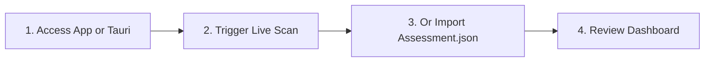

# Getting Started with EIIP

This guide will walk you through accessing the Enterprise Infrastructure Intelligence Platform (EIIP), running the collector script, importing your first assessment, and review results based on your role.

---

## 🧭 Step-by-Step Setup

### 1. Accessing the Application
Open the EIIP web application URL in your preferred modern web browser, or launch the Tauri native desktop application. No registration, accounts, or database installations are needed.

### 2. Running a Live Scan (Zero-Friction)
- Click the **Refresh Assessment** button in the dashboard header.
- **Tauri Native App:** Click **Run Native Workstation Scan** to query local telemetry directly.
- **Web App (Local Daemon):** Ensure the background daemon service is running (connected status will show in green) and click **Run Telemetry Scan**.
- The scan runs automatically, fetches system instrumentation, evaluates findings via the JS engine, and updates the dashboard immediately.

### 3. Alternative: Manual Assessment Import
If you have an exported `Assessment.json` from another machine:
1. Select the **Assessment Importer** tab or click **Manual Legacy Upload** in the refresh modal.
2. Drag-and-drop the generated `Assessment.json` file into the upload panel.
3. The interface will parse the data, evaluate findings in JavaScript, and update the dashboard view.

### 4. Reviewing the Results
Once the scan or import is complete, check your dashboard scores and explore the findings.

``
*Placeholder: Screenshot of the Assessment Importer tab showing drag-and-drop area and upload status logs.*

---

## 👤 User Personas Workflows

To help you get the most out of EIIP, we have defined tailored workflows for four core target personas:

### 🏠 1. Home User
* **Goal**: Keep personal computers running reliably and plan software upgrades cleanly.
* **Workflow**:
  1. Import the latest assessment.
  2. Navigate to the **Software Intelligence** tab.
  3. Filter the update state by **Update Available** or **End-of-Life**.
  4. Expand the details drawer of outdated packages to view their upgrade paths.
  5. Use the **Actions** tab in the drawer to review automated command lines to run locally.

### 💻 2. Developer
* **Goal**: Validate that your machine has the right environments to support local LLMs, Docker containers, database engines, and software toolchains.
* **Workflow**:
  1. Run the assessment script after installing new development tools.
  2. Open the **AI Chat Guardian** tab and select the **AI Review Package** panel.
  3. Click **Export AI Review Package** to download the `MachineReviewPackage.zip`.
  4. Upload the ZIP to your organization's AI assistant (e.g. Claude or ChatGPT) and run the **AI Development Workstation Review** prompt.

### ⚙️ 3. Infrastructure Engineer
* **Goal**: Conduct risk analysis, motherboard/CPU validation, and capacity planning.
* **Workflow**:
  1. Open the **Dashboard** and check the **Overall Health Score** and sub-component health gauges (Performance, Reliability, Scalability).
  2. Navigate to the **Capacity Forecasting** tab.
  3. Review the linear regression charts to see when storage capacity on Disk C: is predicted to cross the 90% and 95% critical exhaustion thresholds.
  4. Compare historical scores in the history timeline to see if system capacity demands are increasing.

### 🕵️ 4. Security Analyst
* **Goal**: Inspect vulnerability exposure, administrative privileges, and software lifecycles.
* **Workflow**:
  1. In the dashboard, inspect the **Risk Matrix** quadrant to see if there are any critical severity/high likelihood risks.
  2. Click the **Auditor** tab to filter findings by the **Security** domain and **Critical** / **High** severity.
  3. Go to the **Topology** graph view, locate the `local_admins` node, and click it. Review the active list of administrator accounts in the details card to check for privilege sprawl.
  4. Search the software catalog for deprecated or unsupported components.
