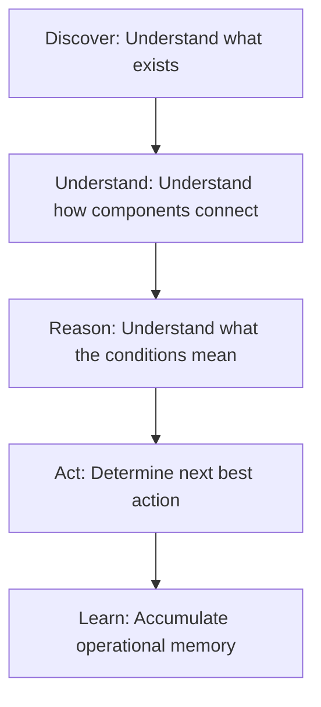

# Welcome to the EIIP / Sentinel Wiki

Welcome to the official documentation for the **Enterprise Infrastructure Intelligence Platform (EIIP) / Sentinel**. 

Sentinel is a fleet-capable infrastructure intelligence system designed to discover, model, assess, correlate, predict, remediate, validate, and learn from enterprise computing environments. Unlike traditional monitoring tools that simply tell you *what happened*, Sentinel builds a living, centralized model of your environment to explain *why it happened*, *what it affects*, and *what should happen next*.

---

## 👁️ Platform Vision

Our core vision is to evolve infrastructure operations from observation to understanding, from understanding to reasoning, and from reasoning to autonomous execution. We accomplish this through five strategic pillars:

1. **Discover**: Identify assets, inventory hardware specifications, operating systems, running services, and security configurations.
2. **Understand**: Reconstruct dependencies and build a topological infrastructure graph showing how components work together.
3. **Reason**: Assess health states, calculate risk metrics, correlate anomalies, and forecast resource limits.
4. **Act**: Plan remediations, validate outcomes, and configure simulated upgrades or uninstalls.
5. **Learn**: Accumulate historical assessments in the centralized ledger, creating an evolving operational memory of the environment.

---

## ✨ Core Benefits (Phase 2 & 3 Capabilities)

* **Centralized Fleet Ledger (Postgres & InsForge)**: Consolidate configuration profiles, OS metadata, package inventory, and vulnerabilities across multiple nodes instead of a single workstation.
* **Closed-Loop Self-Healing Policies**: Define automated remediation rules for findings (e.g., firewall profile status, service status, disk cleaning). Supports both `autonomous` auto-fix execution and manual `approval_gated` oversight.
* **Threat Intelligence & CVE Correlation**: A dedicated Vulnerability Intel database mapping real-time host software catalogs against critical CVE databases (e.g., CVE-2023-27043 for Python, CVE-2023-44487 for Nginx).
* **Automated Telemetry Ingestion API (FastAPI & NATS)**: Streamlined telemetry uploading via `/api/v2/discovery/upload` and legacy V1 JSON migration via `/api/v2/migrate/import`. Ingested data is processed asynchronously with NATS JetStream and CloudEvents 1.0 specifications.
* **Interactive Topology Canvas (React Flow / XYFlow & Graphology)**: Sleek React Flow topology map featuring custom styled nodes (Machine, OS, Service, Database, Storage) with status-based neon highlights (Green, Orange, Red) mapping vulnerability severities.
* **Enterprise RBAC Auth (InsForge Auth)**: Enforce roles (`admin`, `operator`, `auditor`) from JWT claims to secure endpoints and gate operations like running scans or executing remediations.
* **Dynamic Assessment & Risk Engine (RulesEngine)**: Dynamic JSON-based policies evaluating compliance against technical baselines and updating domain health scores and findings in real-time.
* **Local-First Privacy Option**: While centralized enterprise features are supported, the browser application preserves local-first capability (browser-native IndexedDB) for air-gapped workstations or legacy deployments.

---

## 🧭 Navigation Guide

Use the following directory to navigate through the platform guides and documentation:

### 🏁 Getting Started
* **[Getting Started](GettingStarted.md)**: Accessing the UI, logging in with SSO/RBAC roles, running the PowerShell collector, importing assessments, and review workflows for different user personas.

### 📊 Feature Guides
* **[Understanding Your Dashboard](DashboardGuide.md)**: Health Index gauges, findings counts, Risk Matrix quadrants, historical run tracking, Auto-Healing policies, and Vulnerability Intel dashboards.
* **[Software Intelligence Guide](SoftwareIntelligenceGuide.md)**: Search, sort, filter, and group normalized catalogs, and utilize the simulated upgrade/uninstall planners.
* **[Dependency Graph Guide](DependencyGraphGuide.md)**: Interactive topology mechanics, node severity visual borders, and relationship meanings.
* **[Assessment Reports Guide](AssessmentGuide.md)**: Reviewing findings, severity levels, root cause hypotheses, and recommended remediation plans.

### 🤖 AI Workflows
* **[AI Review Package Guide](AIReviewPackageGuide.md)**: Generating the Review Package ZIP, loading it into Claude/ChatGPT/Gemini, and using copy-paste prompts for AI workstation audits.

### 🛠️ Operation & Support
* **[Troubleshooting Guide](TroubleshootingGuide.md)**: Handling script execution policy errors, missing package detection, browser memory limits, and import errors.
* **[Privacy and Security Guide](PrivacyGuide.md)**: Deep dive into the local-first architecture, browser IndexedDB storage details, and trust principles.
* **[Frequently Asked Questions](FAQ.md)**: Standard Q&A covering installation, assessments, software inventory, AI exports, privacy, and roadmap.

### 📝 Governance & Maintenance
* **[Release Notes Template](ReleaseNotesTemplate.md)**: Format for declaring version readiness, discovery metrics, and changelogs.
* **[Documentation Governance Guide](DocumentationGovernanceGuide.md)**: Versioning strategies, screenshot refresh routines, and guidelines for adding wiki content.
