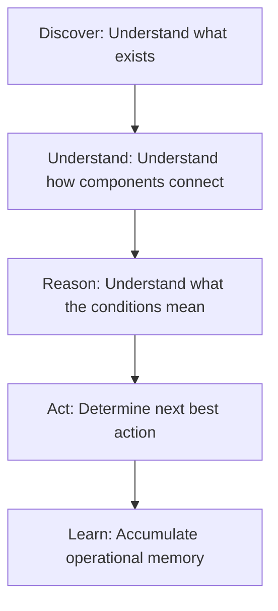

# Welcome to the EIIP Wiki

Welcome to the official documentation for the **Enterprise Infrastructure Intelligence Platform (EIIP)**. 

EIIP is an Infrastructure Intelligence Platform that transforms infrastructure data into operational understanding. Unlike traditional monitoring tools that simply tell you *what happened*, EIIP builds a living, local-first model of your environment to explain *why it happened*, *what it affects*, and *what should happen next*.

---

## 👁️ Platform Vision

Our core vision is to evolve infrastructure operations from observation to understanding, from understanding to reasoning, and from reasoning to autonomous execution. We accomplish this through five strategic pillars:

1. **Discover**: Identify assets, inventory hardware, operating systems, applications, and services.
2. **Understand**: Reconstruct dependencies and build a topological infrastructure graph showing how components work together.
3. **Reason**: Assess health states, calculate risk metrics, correlate anomalies, and forecast resource limits.
4. **Act**: Plan remediations, validate outcomes, and configure simulated upgrades or uninstalls.
5. **Learn**: Accumulate historical assessments in local browser storage, creating an evolving operational memory of the environment.

---

## ✨ Core Benefits

* **Zero Infrastructure Overhead**: Runs instantly in your browser as a static web application. No server deployments, agent agents, database setups, or cloud dependencies.
* **100% Data Sovereignty**: Designed for local-first privacy. Absolutely zero data leaves your local machine. All assessment files imported and historical trends are saved locally inside browser-native IndexedDB.
* **AI-Ready Diagnostics**: Converts complex system logs and registry configurations into a clean, structured ZIP bundle. This bundle can be directly uploaded to Large Language Models (LLMs) to perform automated architecture audits.
* **Lifecycle & Security Awareness**: Normalizes application packages across 9 separate discovery channels (Winget, Chocolatey, Scoop, WSL, Docker, pip, npm, etc.) and highlights End-of-Life (EOL), deprecations, and vulnerability exposures.

---

## 🧭 Navigation Guide

Use the following directory to navigate through the platform guides and documentation:

### 🏁 Getting Started
* **[Getting Started](GettingStarted.md)**: Accessing the UI, running the PowerShell collector, importing assessments, and review workflows for different user personas.

### 📊 Feature Guides
* **[Understanding Your Dashboard](DashboardGuide.md)**: Health Index gauges, findings counts, Risk Matrix quadrants, and historical run tracking.
* **[Software Intelligence Guide](SoftwareIntelligenceGuide.md)**: Search, sort, filter, and group normalized catalogs, and utilize the simulated upgrade/uninstall planners.
* **[Dependency Graph Guide](DependencyGraphGuide.md)**: Interactive topology mechanics, node severity visual borders, and relationship meanings.
* **[Assessment Reports Guide](AssessmentGuide.md)**: Reviewing findings, severity levels, root cause hypotheses, and recommended remediation plans.

### 🤖 AI Workflows
* **[AI Review Package Guide](AIReviewPackageGuide.md)**: Generating the Review Package ZIP, loading it into Claude/ChatGPT/Gemini, and using copy-paste prompts for AI workstation audits.

### 🛠️ Operation & Support
* **[Troubleshooting Guide](TroubleshootingGuide.md)**: Handling script execution policy errors, missing package detection, browser memory limits, and import errors.
* **[Privacy and Security Guide](PrivacyGuide.md)**: Deep dive into the local-first architecture, browser IndexedDB storage details, and trust principles.
* **[Frequently Asked Questions](FAQ.md)**: Standard Q&A covering installation, assessments, software inventory, AI exports, privacy, and roadmap.

### 📝 Governance & Maintenance
* **[Release Notes Template](ReleaseNotesTemplate.md)**: Format for declaring version readiness, discovery metrics, and changelogs.
* **[Documentation Governance Guide](DocumentationGovernanceGuide.md)**: Versioning strategies, screenshot refresh routines, and guidelines for adding wiki content.
